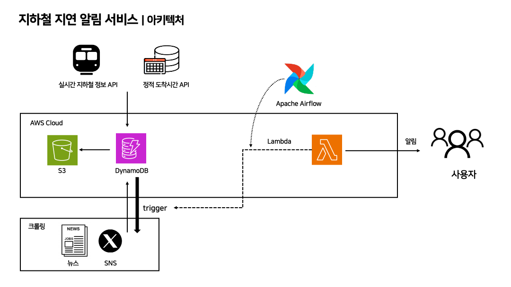

# Team1_CoffeeBara
Softeer bootcamp 6기 DE 1팀 개발 레포지토리입니다.

## 주제
자동차 제조/판매/운용 또는 교통/모빌리티와 관련된 분야에서, 상업적으로 사용에 문제가 없는 공개된 데이터와 온라인 상에 공개된 소비자들의 반응 데이터를 직접 수집/가공/활용해서 상업적 가치를 만들어 내는 Data Product

## 문제 정의
2025년 7월 4일 오전 7시 50분, 서울대입구역에서 신호 장애로 2호선 내·외선 운행이 크게 지연되는 일이 있었습니다. 출근 시간임에도 불구하고, 10분 만에 겨우 도착한 지하철조차 승객이 너무 많아 타지 못하는 경우가 많았습니다. 비록 뉴스 속보를 통해 지연 소식을 확인할 수 있지만, 바쁜 아침에 직장인들이 이를 일일이 확인하기는 어렵습니다. 결국 승강장에 들어가 카드를 찍은 뒤에야 역 내 방송으로 상황을 알게 되고, 얼마나 심각한 지연인지 모르는채로 회사에 지각할까 조마조마해집니다. 즉, 심각한 지연에 대해 그 원인까지 분석하여 알림을 주는 서비스가 부재합니다.

## 데이터 프로덕트 제안
### 해결 방법
서울교통공사에서 도착 예정 시간과 현재 지하철 위치를 기준으로 지연 시간을 계산하고, 지하철 지연이 5분 이상 발생하면 커뮤니티 반응과 뉴스 속보를 통해 지연의 심각성을 판단합니다. 사용자의 현재 위치에서 가까운 2, 3개 역에서 이러한 심각한 지연이 발생한 경우, 해당 사용자에게 알림을 주는 서비스를 제안합니다.

### 사용 데이터 및 실행 로직
지하철의 실시간 운행 정보를 출근시간 오전5시~10시에서 **2분 단위로 수집**하여 **지연 시간**을 계산합니다.

(월요일 오전 8:50 기준 2호선 단방향 33대 운행 중)

- 서울교통공사의 `실시간 열차 운행 정보`
    
    (https://smss.seoulmetro.co.kr/traininfo/traininfoUserView.do)
    
- 열린데이터광장의 `서울시 지하철 실시간 도착정보 API` (하루 최대 1,000건 요청 제한)
    
    (https://data.seoul.go.kr/dataList/OA-12764/F/1/datasetView.do?)
    
- 서울교통공사의 `역코드 기반 정적 지하철 도착 정보 API` (하루 최대 1,000건 요청 제한)
    
    (https://www.data.go.kr/data/15058078/openapi.do?recommendDataYn=Y&)

만약 **심각한 지연이 발생**한 경우, 아래의 **뉴스 속보**와 **커뮤니티 및 SNS 데이터**를 수집하여 올라오는 글의 수, 표현 등을 바탕으로 지하철 지연의 심각성과 그 원인을 판단합니다.

- 네이버 디벨로퍼스 뉴스 검색 API - ‘지연’, '2호선' 키워드 기반의 뉴스 메타데이터 수집. 하루 최대 25,000회 요청)
    
    (https://developers.naver.com/docs/serviceapi/search/news/news.md?)
    
- 인스타그램 쓰레드
- X (구 트위터)

이를 바탕으로 심각한 지연이 발생한 노선의 사용자에게 알림을 전송합니다.

(추가기능 : 월별 지연 정보를 시각화로 제공합니다.)

## 데이터 파이프라인
### 아키텍처 개요
1. 수집
- 지하철의 실시간 운행 정보를 출근시간 오전5시~10시에서 **2분 단위로 수집**하여 **지연 시간**을 계산합니다.
    - 서울교통공사 API에서 받은 실시간 지하철 데이터는 DynamoDB에 저장하여 Lambda로 처리합니다. 이후 데이터 백업은 S3에 저장합니다.
    - 지연 시간 계산 로직을 통해 5분 이상 지연 될 시에 Lambda trigger를 발생시켜서 뉴스 속보와 커뮤니티, SNS 데이터를 수집하고 저장소 DynamoDB에 저장합니다.
2. 처리
- 지하철 운행 데이터에서 아래 항목을 가져옵니다. 지연 계산은 Lambda(Spark)로 수행하고, 도착 예정 시간에서 실제 도착 시간을 뺀 결과를 DynamoDB에 저장합니다. 후에 TTL(Time-to-live)로 2시간 후 이전 데이터는 자동으로 삭제해서 DynamoDB 공간 비용을 절감합니다.

3. 알림
- 심각한 지연에 대해 트리거 발생
    - 지연 계산 결과를 DynamoDB에 저장하고, 지연 시간이 5분 이상이면 Lambda 이벤트를 발생시킵니다.
    - 동일한 지연에 대한 중복 계산을 막기 위해 같은 라인, 역, 방향에서 10분 내 동일 이벤트는 트리거 실행을 금지합니다.
- 지연 원인 크롤링
    - 트리거가 실행되면 뉴스 속보와 커뮤니티 게시글을 수집하고 요약, 태깅 결과를 DynamoDB에 저장합니다.
    - 저장된 데이터를 분석하여 지연의 원인을 키워드로 추출합니다.
    - 커뮤니티 게시글이 발행된 개수와 뉴스 속보로 올라온 빈도 수 등을 수집하여 지연의 심각성을 계산하고, 이를 DynamoDB에 저장합니다.
    - 이 결과를 S3에 백업합니다.
- 알림 전송 여부 판단
    - DynamoDB의 심각성 컬럼의 변경 여부를 체크합니다.
        1. 사용자 선호 노선을 (즐겨찾는 역, 출근 시간대) 조회합니다.
        2. 현재 사용자의 위치를 기준으로 근접 역 2~3개를 매칭합니다.
        3. 심각한 지연이 발생한 역 근처의 사용자에게 알림을 전송합니다. 사용자별로 20분 내 동일한 노선의 지연 알림은 1회 발송하며, 지연이 계속되어 심각성이 악화될 시에만 재알림을 보냅니다.
4. 발송
    - Lambda를 이용하여 알림 전송합니다.

### 아키텍처 시각화

## 커피바라 팀원 소개

> 커피와 카피바라를 좋아하는 DE 1팀입니다!

 

<table>
<th>팀원</th>
    <th> 노하연 <a href="https://github.com/nohhha"> <a></th>
	  <th> 박도현 <a href="https://github.com/ManRaccoon"> </a></th>
    <th> 유혜원 <a href="https://github.com/mariahwy"> </a></th>
    <tr>
    <td> 팀원 소개 </td>
    	<td>
        
      </td>
    	<td>
        
     </td>
      <td>
        
      </td>
    </tr>
    <tr>
	<td> 역할 </td>
	<td>
		
DE

	</td>
	<td>
		
DE

	</td>
	<td>
		
DE

	</td>
    </tr>
  </table>

 
 

### 코드 컨벤션

---

### 협업 툴 사용법

| Tool | 사용 목적 |
|------|-----------|
| 🧠 **Notion** | 회의록, 기획안, 데일리 스크럼 문서화 |
| 💬 **Slack** | 실시간 커뮤니케이션 & 일정 조율 |
| 🐙 **GitHub** | 코드 관리 + PR & 리뷰 관리 |

---

## 🛠️ 기술 스택

## 🗂️ 폴더구조
