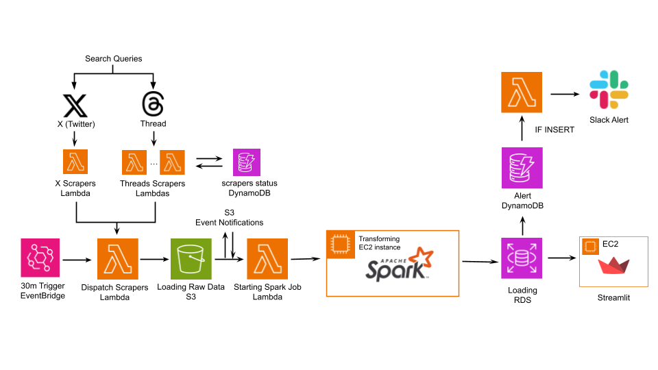

# Team1_CoffeeBara
Softeer bootcamp 6기 DE 1팀 개발 레포지토리입니다.

## 주제
자동차 제조/판매/운용 또는 교통/모빌리티와 관련된 분야에서, 상업적으로 사용에 문제가 없는 공개된 데이터와 온라인 상에 공개된 소비자들의 반응 데이터를 직접 수집/가공/활용해서 상업적 가치를 만들어 내는 Data Product

## 문제 정의
현대자동차그룹의 PR팀의 SNS 모니터링 담당자는 회사가 사전에 정의한 차량 관련 리스크에 대해 다양한 채널에서 모니터링을 진행합니다. 하지만 SNS는 동시다발적으로 데이터가 생성되기 때문에 발생 가능한 모든 리스크를 일일이 모니터링하기에는 한계가 존재합니다.

## 해결 방법 (데이터 프로젝트 제안)
따라서 어느 정도 확산 가능성이 있는 리스크만 선별적으로 알려주는 데이터 프로덕트를 제안합니다. 현대자동차그룹 차량과 관련된 SNS 데이터를 수집하여 리스크 여부와 관련있는 데이터를 골라냅니다. 이후, 키워드를 추출하고, 사전에 정의해둔 리스크 유형별 분류를 통해 특정 리스크나 키워드의 언급량이 평소보다 많이 증가할 때 모니터링을 권고하는 slack 알림을 보냅니다. 그리고 대시보드를 통해 해당 리스크를 모니터링 하기 위한 다양한 지표를 시각적으로 제공합니다.


## 데이터 파이프라인
### 1. Extract
- X-scraper, Threads-scraper
    - 각각의 소셜 미디어 채널(X, Threads)에서 특정 검색 쿼리에 대한 게시글을 수집하는 AWS Lambda 함수입니다.
    - Dispatcher로부터 실행 명령을 받으면, 각 채널에서 데이터를 수집하여 S3에 raw data로 저장합니다. 또한 실행 상태를 DynamoDB 상태 테이블에 기록하여 스크래핑을 안정적으로 처리합니다.
- Dispatcher
    - 여러 Scraper들을 한 번에 병렬적으로 실행시키는 역할을 하는 AWS Lambda 함수입니다.
    - Amazon EventBridge에 의해 30분마다 정기적으로 트리거되며, 실행될 때마다 X-scraper, Threads-scraper 등 사전에 등록된 모든 Lambda 함수를 비동기적으로 호출합니다.
### 2. Transform
- spark-job
    - pyspark로 S3에 저장된 raw 텍스트 데이터를 배치 단위로 분석하여 주의깊게 모니터링 해야하는 리스크를 선별하는 기능입니다.
    - 사전 정의된 리스크 키워드(wordbag)을 기반으로 텍스트를 리스크 유형과 키워드로 매핑하고, DynamoDB에 저장된 과거 데이터를 바탕으로 리스크 점수를 계산합니다. 주요 분석 지표는 단기 증가율, 장기 추세, 점유율 등이며, 이를 종합해서 최종 점수를 산출합니다.
    - 점수가 특정 임계치를 넘으면 위험으로 간주하여 DynamoDB Alert 테이블에 저장하며, 전체 분석 결과는 RDS에 저장하여 대시보드 시각화에 사용합니다.
### 3. Load
- S3
    - SNS에서 30분 주기로 수집되는 raw data를 적재하는 데이터 레이크 역할을 합니다. 적재된 파일은 S3 Event Notification을 통해 EC2에서 Spark Job을 실행하는 람다를 트리거하고, Spark Job이 처리해야할 데이터 소스로 사용됩니다.
- DynamoDB
    - 빠른 읽기/쓰기가 필요한 데이터를 목적에 따라 분리하여 효율적으로 적재합니다.
    - Category Count DB: Spark가 30분 주기로 집계한 리스크 유형별 통계 데이터를 적재합니다. 이 데이터는 다음 배치에서 리스크 점수 계산을 위한 과거 데이터로 다시 사용됩니다.
    - Alert DB: Spark 분석 결과, 특정 임계치를 초과한 경고 데이터만을 최종적으로 선별하여 적재합니다. 이 테이블에 데이터가 적재되면, DynamoDB Streams를 통해 Slack 알림을 보내는 람다를 트리거합니다.
- RDS
    - Spark가 처리한 모든 통계 및 리스크 지표 데이터를 구조화하여 최종적으로 적재하는 데이터 웨어하우스 역할을 합니다.
    - 적재된 데이터는 Tableau 대시보드를 통해 시각화됩니다.

### 4. Alert
- Spark 분석 결과, 리스크 점수가 임계치를 초과한 데이터가 Alert DynamoDB에 적재되면, 이벤트를 감지한 Lambda 함수가 즉시 Slack 채널으로 알림을 보냅니다. 이를 통해 담당자는 SNS 상에서 확산될 위험성이 있는 특정 리스크를 집중적으로 모니터링 할 수 있습니다.

## 아키텍처 시각화



## 커피바라 팀원 소개

> 커피와 카피바라를 좋아하는 DE 1팀입니다!

<br/>

<div align="center">
<table>
<th>팀원</th>
    <th><a href="https://github.com/nohhha">노하연</a></th>
	<th><a href="https://github.com/ManRaccoon">박도현</a></th>
    <th><a href="https://github.com/mariahwy">유혜원</a></th>
    <tr>
    <td>  </td>
    	<td>
        
      </td>
    	<td>
        
     </td>
      <td>
        
      </td>
    </tr>
    <tr>
	<td> 역할 </td>
	<td>
		<p align="center">DE</p>
	</td>
	<td>
		<p align="center">DE</p>
	</td>
	<td>
		<p align="center">DE</p>
	</td>
    </tr>
  </table>
</div>
<br />
<br />


### 협업 툴 사용법

| Tool | 사용 목적 |
|------|-----------|
| 🧠 **Notion** | 회의록, 기획안, 데일리 스크럼 문서화 |
| 💬 **Slack** | 실시간 커뮤니케이션 & 일정 조율 |
| 🐙 **GitHub** | 코드 관리 + PR & 리뷰 관리 |

---

## 🛠️ 기술 스택
- 

## 🗂️ 폴더구조
```md
/Team1_CoffeeBara
├── Extract
│   ├── x_crawler/
│   ├── threads_crawler/
│   └── README.md
├── Transform
│   ├── conf/
│   ├── entrypoints/
│   ├── jobs/spark-job.py
│   ├── docker-compose.yml
│   ├── Dockerfile
│   └── README.md
├── Alert
│   ├── slack_lambda_function.py
│   └── README.md	
├── Dashboard
│   ├── app.py
│   └── README.md
├── images/
└── README.md

```
